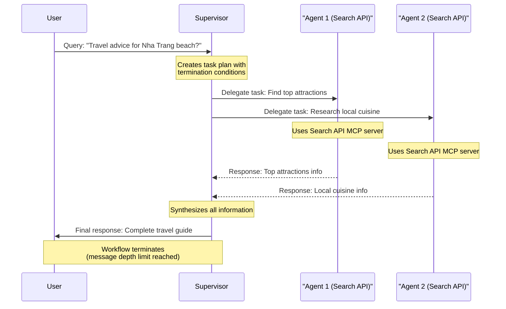

# A2A LangGraph Boilerplate

This project is a boilerplate for developers who want to start building an AI agent cluster with A2A and MCP servers integration faster and more efficiently.

- [Project Overview](PROJECT_OVERVIEW.md)
- [Agent Instructions](AGENT_INSTRUCTIONS.md)

## Features

*   Create & manage AI crews
*   Create & manage AI agents
*   Create & manage MCP servers
*   Create & manage Tools
*   Integrate MCP servers for tool usage
*   Monitor activity logs
*   Create & manage conversations with AI crews / AI agents
*   Expose Swagger API Docs for frontend integration instructions

## Concept
* Each AI agent cluster can have multiple AI agent crews (AI Crews)
* Each AI crew can have multiple AI agent, leaded by a superviser (a default AI agent of an AI crew)
* Each AI agent can call tools via MCP servers integration

## How it works
* A supervisor agent will receive input (prompt) from a user via API call, then create a detailed plan with its current capabilities (AI agents underneat and their tools)
* Then request the AI agents to perform tasks via A2A protocol
* Wait for all AI agents finish given tasks
* Grab all the results, analyze and decide to assign more tasks to AI agents, or finish the plan
* Synthesize the results and respond to user based on the original input prompt.

### Example workflow:
* Case 1: **Simple Direct Response** - User asks "hello" and supervisor decides to answer directly with a simple response. This requires no agent delegation and completes in a single workflow step.
* Case 2: **Multi-Agent Collaboration with Termination Control** - User asks for travel advice about Nha Trang beach (Vietnam):
  1. Supervisor receives query and creates a task plan with clear termination conditions
  2. Supervisor delegates to agent 1 (connected to Search API MCP server) to find top attractions
  3. Supervisor delegates to agent 2 (connected to Search API MCP server) to research local cuisine
  4. Each agent responds with its findings in a single message back to supervisor
  5. Supervisor synthesizes all information into a final response
  6. Workflow terminates after supervisor's final response (enforced by message depth limit)

### Diagram of example flow



## Getting Started

### Prerequisites

*   Python 3.11+
*   PostgreSQL

### Installation

1.  **Clone the repository:**
    ```bash
    git clone https://github.com/your-username/a2a-langgraph-boilerplate.git
    cd a2a-langgraph-boilerplate
    ```

2.  **Create and activate a virtual environment:**
    ```bash
    python3 -m venv venv
    source venv/bin/activate
    ```

3.  **Install the dependencies:**
    ```bash
    pip install -r requirements.txt
    ```

4.  **Set up the database:**
    *   Ensure your PostgreSQL server is running.
    *   Create a new database named `a2a-langgraph-boilerplate`. You can use the following command:
        ```bash
        createdb "a2a-langgraph-boilerplate"
        ```
    *   Copy the `.env.example` file to `.env`:
        ```bash
        cp .env.example .env
        ```
    *   Update the `DATABASE_URL` in the `.env` file with your PostgreSQL credentials.

5.  **Create the database tables:**
    ```bash
    python create_tables.py
    ```

### Running the Application

To start the application, run the following command:

```bash
uvicorn app.main:app --reload
```

The application will be available at `http://127.0.0.1:8000`.

### Running the tests

To run the tests, run the following command:

```bash
source .venv/bin/activate
which python
python -m pytest tests/ -v
```

### Run specific test

```bash
# To run all tests in the tests directory:
python -m pytest tests/

# To run the UUID model tests we implemented:
python -m pytest test_uuid_models.py

# To run a specific test file:
python -m pytest tests/test_crews.py
```

### [Special] Run AI crew chat workflow demonstration

```bash
python -m tests.test_ai_crew_simple_demo
```

## API Documentation

The API documentation is automatically generated by FastAPI and is available at the following URLs:

*   **Swagger UI:** [http://127.0.0.1:8000/docs](http://127.0.0.1:8000/docs)
*   **ReDoc:** [http://127.0.0.1:8000/redoc](http://127.0.0.1:8000/redoc)

## Credits

*   [@goon_nguyen](https://x.com/goon_nguyen)
*   Github: [https://github.com/mrgoonie](https://github.com/mrgoonie)
*   Substack: [https://goonnguyen.substack.com/](https://goonnguyen.substack.com/)
